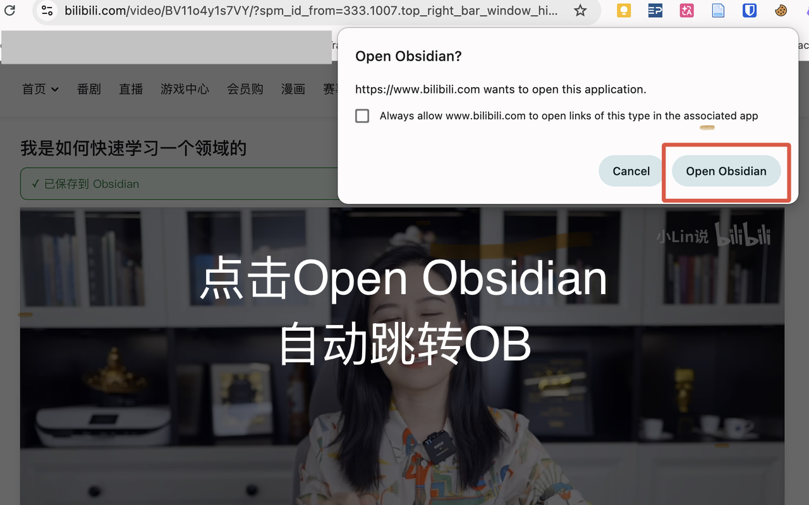
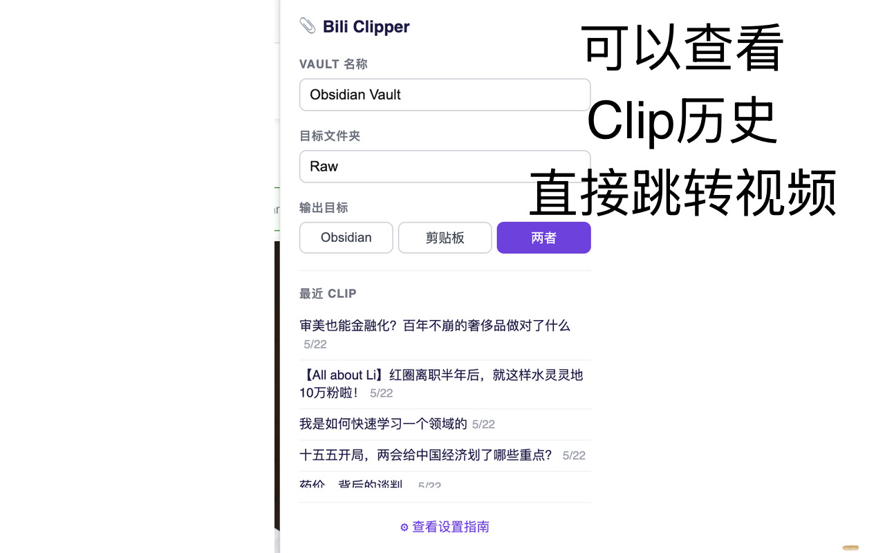

# Bili Clipper · B 站字幕一键存 Obsidian

Chrome 扩展，点一下，B 站视频字幕自动进 Obsidian，2 秒完成。

**不需要配置任何东西。** 无需安装 Obsidian 插件，无需 Local REST API，无需服务器，装完即用。

仅支持有 CC 字幕的视频。

## 安装要求

- Chrome 浏览器
- [Obsidian](https://obsidian.md)

## 安装方法

**方式一：Chrome Web Store（审核中，即将上线）**

> 上线后可直接从商店一键安装。

**方式二：手动安装（当前可用）**

1. 下载 [bilibili-to-obsidian.zip](https://github.com/echore/bilibili-to-obsidian/raw/master/bilibili-to-obsidian.zip) 并解压
2. 打开 `chrome://extensions`，右上角开启**开发者模式**
3. 点击**加载已解压的扩展程序** → 选择解压后的 `extension/` 文件夹

## 配置

点击 Chrome 工具栏中的 Bili Clipper 图标，填写：

- **Vault 名称** — Obsidian 标题栏显示的文件夹名称（例如 `Obsidian Vault`）
- **目标文件夹** — Vault 内保存笔记的子文件夹（留空则保存到 Vault 根目录）
- **输出目标** — `Obsidian`（自动在 Obsidian 中打开笔记）、`剪贴板`（仅复制到剪贴板）或`两者`

## 使用方法

打开任意有 CC 字幕的 B 站视频，视频标题下方会出现 **Clip 栏**，点击 **Clip** 即可。笔记会保存到 `<目标文件夹>/<视频标题>.md`，并自动在 Obsidian 中打开。

无 CC 字幕的视频不显示 Clip 栏。






## 笔记格式

```markdown
---
title: "如何快速学习陌生领域"
source: https://www.bilibili.com/video/BVxxx
platform: bilibili
author: "UP主名字"
date: 2026-05-22
tags: [transcript, bilibili]
transcript_method: cc_subtitle
---

<iframe src="https://player.bilibili.com/player.html?bvid=BVxxx&..." ...></iframe>

## 简介
视频描述文字（仅在有简介时出现）

## 字幕

### 章节名 `0:00`
合并后的段落文字…

### 章节名 `5:30`
合并后的段落文字…
```

无章节的视频，字幕按停顿自动合并为段落，直接列在 `## 字幕` 下。

## 常见问题

**Obsidian 没有自动打开**
检查扩展 popup 中的 Vault 名称是否与 Obsidian 标题栏显示的完全一致（大小写、空格都要匹配）。

**Clip 栏显示为灰色**
该视频没有 CC 字幕，Bili Clipper 目前仅支持有 CC 字幕的视频。

## 隐私政策

[查看隐私政策](https://echore.github.io/bilibili-to-obsidian/privacy-policy.html) — 扩展不收集、不上传任何用户数据，所有数据仅存储在本地。

## 参考致谢

- [haixiong1997/Bilibili-Obsidian-Clipper](https://github.com/haixiong1997/Bilibili-Obsidian-Clipper) — 笔记格式参考
- [kangchainx/video-text-chrome-extension](https://github.com/kangchainx/video-text-chrome-extension) — 架构参考（MIT）
- [IndieKKY/bilibili-subtitle](https://github.com/IndieKKY/bilibili-subtitle) — Bilibili API 参考
