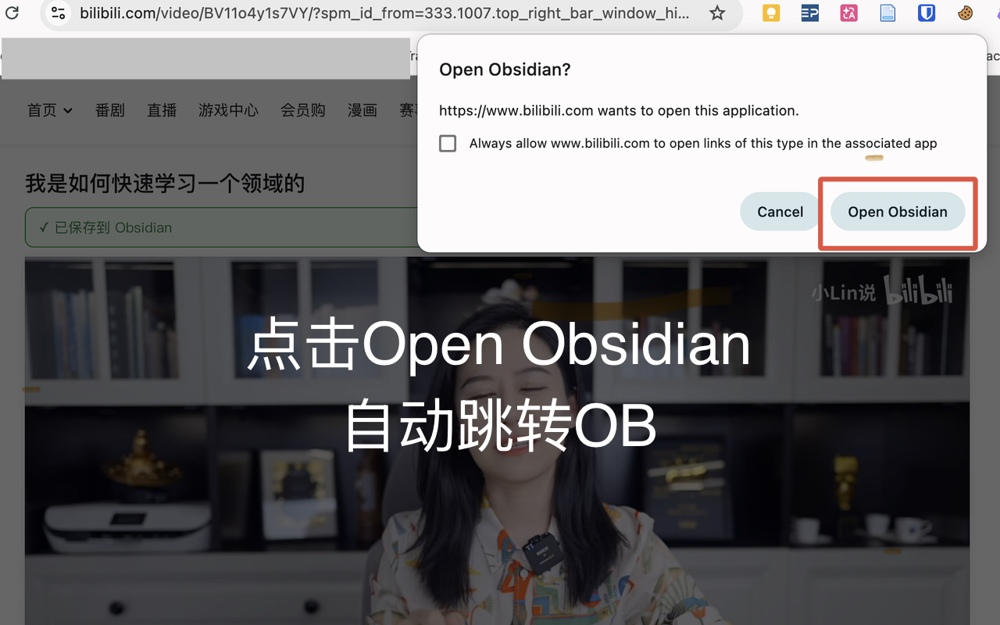
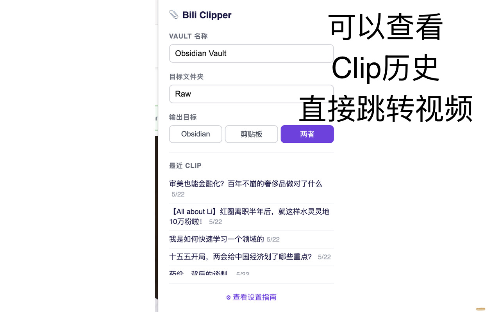

# Bili Clipper · B 站字幕一键存 Obsidian / Notion

[](https://github.com/echore/bili-clipper/releases/latest)

Chrome 扩展，点一下，B 站视频字幕自动进 Obsidian 或 Notion，2 秒完成。

**Obsidian 零配置，装完即用**：无需安装 Obsidian 插件，无需 Local REST API，无需服务器。

**Notion 仅需简单设置**：在引导页跟着点一遍即可。

## 安装要求

- Chrome 浏览器
- [Obsidian](https://obsidian.md) 或 [Notion](https://www.notion.so) 账号（按所选输出目标，至少其一）

## 安装方法

**方式一：Chrome Web Store（推荐）**

> [点击安装](https://chromewebstore.google.com/detail/gbfmnhlfkapbddhldhmpegicppfebbdh) — 一键从商店安装。

**方式二：手动安装（备用）**

1. 下载 [bili-clipper.zip](https://github.com/echore/bili-clipper/releases/latest/download/bili-clipper.zip) 并解压
2. 点击浏览器右上角的扩展图标（拼图形状），在弹出菜单底部点击**管理扩展程序**

   

3. 进入扩展管理页面后，确认右上角的**开发者模式**已开启（蓝色即为开启）
4. 点击左上角的**加载已解压的扩展程序**，在弹出的文件选择器中选中解压后的 `extension/` 文件夹，点击**选择**

   

## 配置

安装后会自动弹出设置引导页，按提示填写即可。也可以随时点击 Chrome 工具栏中的 Bili Clipper 图标打开设置。

首先选择**输出目标**（可多选）：`Obsidian`（自动在 Obsidian 中打开笔记）、`Notion`（写入 Notion database）、`剪贴板`（仅复制到剪贴板），然后完成对应工具的设置：

### Obsidian 设置

- **Vault 名称** — Obsidian 标题栏显示的文件夹名称（例如 `Obsidian Vault`），区分大小写
- **目标文件夹** — Vault 内保存笔记的子文件夹（留空则保存到 Vault 根目录）

### Notion 设置

勾选 Notion 输出后，需要一次性设置：创建一个 Notion connection → 把目标 database 连接给它 → 回扩展点 **Connect** 选择即可。

## 使用方法

打开任意有 CC 字幕的 B 站视频，页面**右上角**会出现紫色 **Clip 浮动栏**，点击 **Clip** 即可。笔记会保存到 `<目标文件夹>/<视频标题>.md`，并自动在 Obsidian 中打开；勾选 Notion 时同时写入所选 database。

无 CC 字幕的视频不显示 Clip 栏。浮动栏支持点击 **−** 最小化为小圆圈，点击圆圈再展开。






## 笔记格式

```markdown
---
title: "如何快速学习陌生领域"
source: https://www.bilibili.com/video/BVxxx
platform: bilibili
author: "UP主名字"
date: 2026-05-22
tags: [transcript, bilibili]
transcript_method: cc_subtitle
---

<iframe src="https://player.bilibili.com/player.html?bvid=BVxxx&..." ...></iframe>

## 简介
视频描述文字（仅在有简介时出现）

## 字幕

### 章节名 `0:00`
合并后的段落文字…

### 章节名 `5:30`
合并后的段落文字…
```

无章节的视频，字幕按句号/逗号/停顿自动合并为段落，每段带时间戳，直接列在 `## 字幕` 下：

```
**0:00** · 第一段文字内容…

**0:42** · 第二段文字内容…
```

## 推荐学习工作流（AI 增强版）

Bili Clipper 保存的是原始字幕，配合以下工作流可以把它变成真正吸收的知识。

### 一次性配置

1. 在 Obsidian 中安装 [Claudian](https://github.com/YishenTu/claudian) 插件
2. 把 [LLM Wiki 配置文档](https://gist.github.com/karpathy/442a6bf555914893e9891c11519de94f) 发给 Claude Code 或 Codex，让 AI 自动完成配置

### 日常使用

**1. Clip**　用 Bili Clipper（B 站）或 [Obsidian Web Clipper](https://obsidian.md/clipper)（YouTube、X 等其他平台）将内容保存到 Obsidian `Raw` 文件夹。官方 Web Clipper 支持绝大多数平台，但不支持 B 站——这正是 Bili Clipper 存在的原因。

**2. Ingest**　在 Obsidian 中打开 Claudian，输入 `ingest`，AI 自动将原始字幕整理为结构清晰的笔记，存入 `Wiki` 文件夹。只需 Claude 订阅，不消耗 API Key。

**3. 深化**　针对不理解的部分继续追问 AI，让 AI 将问答总结后追加到笔记，笔记随理解一起生长。

**4. 费曼复习**　让 AI 基于最新笔记用费曼学习法提问，检验真正理解了多少。

`Raw`（源字幕）→ `Wiki`（AI 整理）→ 追问深化 → 费曼检验，形成完整学习闭环。

## 支持这个项目

如果觉得有用，欢迎点个 ⭐ [Star](https://github.com/echore/bili-clipper)

更多内容见[我的主页](https://navi-liart-nine.vercel.app/) — 专为非开发背景用户设计，门槛低，入门友好

## 常见问题

**Obsidian 没有自动打开**
检查扩展 popup 中的 Vault 名称是否与 Obsidian 标题栏显示的完全一致（大小写、空格都要匹配）。

**Clip 栏显示为灰色**
该视频没有 CC 字幕，Bili Clipper 目前仅支持有 CC 字幕的视频。

## 隐私政策

[查看隐私政策](https://echore.github.io/bili-clipper/privacy-policy.html) — 扩展不收集任何用户数据；仅在你勾选 Notion 输出时，笔记内容（标题、字幕、视频链接）才会发送至 Notion 官方 API，其余数据全部仅存本地。

## 参考致谢

- [haixiong1997/Bilibili-Obsidian-Clipper](https://github.com/haixiong1997/Bilibili-Obsidian-Clipper) — 笔记格式参考
- [kangchainx/video-text-chrome-extension](https://github.com/kangchainx/video-text-chrome-extension) — 架构参考（MIT）
- [IndieKKY/bilibili-subtitle](https://github.com/IndieKKY/bilibili-subtitle) — Bilibili API 参考
